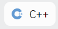
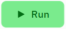

# 1. Programmeren, hoe te beginnen?


Hieronder een eerste C++ programma:

```clike
#include <iostream> 
using namespace std;

int main(){
  cout << "Hallo allemaal!";  
  return 0;              
}
```

``

**Opdracht 1**

1. Open de website [https://replit.com/](https://replit.com/)
2. Maak een account aan
3. Als je ingelogd bent dan open je een c++ editor met de knop 
4. Hierna klik je op de knop
5. Je ziet nu een editor waarin je je eerste C++ programma kan schrijven, hier kan je de C++ code die hierboven staat overtypen.
6. Als je programma klaar is dan kan je het programma runnen met de knop
7. In de console aan de rechterkant zie het resultaat van je programma

Gefeliciteerd je hebt je eerste C++ programma geschreven!

Hieronder wordt het eerste C++ programma dat je geschreven hebt iets meer uitgelegd:

* Regel 1: #include \<iostream> importeert de library voor input en output functies. Dit zorgt ervoor dat het commando cout kan gebruiken.
* Regel 2: using namespace std; -> Sommige functies staan in de standaard library (std). Met deze regel kun je deze functies zonder std:: ervoor te typen
* Je hoeft je nog geen zorgen te maken als je nog niet snapt wat #include of using namespace precies is, zie het voor nu als 2 commando’s waarmee je programma altijd begint.
* Regel 4: Je code staat in de functie main(). Alle code tussen de haakjes { en } behoort tot de functie main.
* Regel 5: met het commando cout kun je tekst naar het scherm schrijven. In dit geval schrijven we de tekst “Hallo Allemaal”. Cout staat voor character out.
* Regel 6: return 0 is het einde van de functie main
* Elke regel in C++ wordt afgesloten met een ;

Met de opdracht cout kun je dus schrijven naar het scherm. Je kan zoveel cout commando’s gebruiken als je wil.

```clike
#include <iostream>  
using namespace std;

int main(){
  cout << "Hallo allemaal!" << endl;  
  cout << "Programmeren is leuk!" << endl;
  cout << "We leren C++";
  return 0;              
}
```

**Opdracht 2**\
****Wat doet het commando endl in bovenstaande code?  \
Probeer de code uit in je C++ editor.
