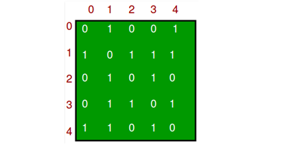

# 10. Grafen

**Grafentheorie**

Een graaf bestaat uit knopen (Vertices) en kanten (Edge)

&#x20;.png>)

&#x20;Bovenstaande graaf bestaat uit 5 knopen {0, 1, 2, 3, 4} en 7 kanten {01, 04, 12, 13, 14, 23, 34}. Deze graaf is ongericht (undirected) dat betekent dat er een verbinding is tussen knoop 0 en 4 maar ook tussen knoop 4 en 0. Ook is deze graaf ongewogen (unweighted) omdat elke edge een gelijk gewicht heeft.

&#x20;Er zijn verschillende manieren om een graaf op te slaan:

#### &#x20;**Adjency List**

De Adjecency list is de meest standaard manier om grafen op te slaan. Het is een array of lists. Elke list slaat de buren van een knoop op.

De adjency list van bovenstaande graaf is:

Adj\[0] (1) (4)\
Adj\[1] (0) (2) (3) (3)\
Adj\[2] (1) (3)\
Adj\[3] (1) (2) (4)\
Adj\[4] (0) (1) (3)

De c++ code voor een adjency list is:

```clike
vector<int> adj[MAXN];
int main(){ 
cin >> n; // Het aantal knopen 
cin >> m; // Het aantal kanten 
for(int i = 0; i < m; i++){ 
    int a, b; 
    cin >> a >> b; 
    adj[a].push_back(b); 
    adj[b].push_back(a);
    } 
return 0; 
}
```

#### **Adjecency matrix**

Een andere manier om de graaf op te slaan is met een Adjecency matrix van size V x V.  Een adjecency matrix is een 2D array met een 1 als er een verbinding is tussen 2 knopen, en een 0 als er geen verbinding is.

&#x20;

De adjency matrix van bovenstaande graaf is:



De c++ code voor een adjecency matrix is:

```clike
int adj[MAXN][MAXN]; 
 
int main(){
  cin >> n; // Het aantal knopen 
  cin >> m; // Het aantal kanten 
  for(int i = 0; i < m; i++){ 
    int a, b;
    cin >> a >> b;
    adj[a][b] = 1; 
    adj[b][a] = 1; 
  }
  return 0;
}
```

**Opdrachten adjecency list/matrix**

1. Schrijf een programma dat een adjecency list kan opslaan. Voeg de volgende 2 functies toe:\
   \- public void addEdge(int i, int j). addEdge voegt een edge toe aan de graaf\
   \- public boolean isEdge(int i, int j).  isEdge bepaalt of een edge een verbinding heeft of niet.
2. De graad van een knoop is het aantal zijden waarmee de knoop verbonden is. Bijvoorbeeld de graad van knoop 0 in bovenstaande graaf is 2.\
   Schrijf een programma dat de som van de graad van alle knopen bepaald van bovenstaande graaf.

### **Breadth first search**

&#x20;Breadth first search is een algoritme voor het doorzoeken van een graaf.

&#x20;Je houdt bij welke knopen al bezocht zijn in de array Visited. Ook is er een queue om bij te houden welke knopen we gaan bezoeken. Een queue werkt volgend FIFO (first in, first out) principe, waarbij geldt dat het element dat het eerst werd toegevoegd het eerst wordt verwijderd.

1\.       Voeg een knoop waar je wil beginnen toe aan de queue.\
Daarna herhaal de volgende stappen totdat er geen knopen meer in de queue staan:\
2\.       Neem de eerste knoop in de queue, markeer deze als visited\
3\.       Als deze knoop buren heeft, voeg alle buren die nog niet bezocht zijn toe aan de queue\
4\.       Verwijder de knoop van de queue

.png>)

Hieronder de code voor een queue in C++. De queue voegt elementen aan het eind van de array toe en verwijdert elementen aan het begin van de array.\
queue q;

`q.push(1); //voegt element 1 toe`\
`q.push(10); //voegt element 10 toe`\
`q.push(2); //voegt element 2 toe`\
`q.pop(); //verwijdert element 1`

****

**Nog wat begrippen**

&#x20;

.png>)

Bij een gewogen graaf sla je ook het gewicht van de graaf op. In een adjeceny list krijg je dan:

Adj\[0] (1, 4) (2,2) (3, 1)\
Adj\[1] (0,4) (2,6)\
Adj\[2] (0,2) (1,6) (3,8)\
Adj\[3] (0,1) (2,8)

&#x20;In een adjency matrix sla je bij een gewogen graaf in plaats van enen en nullen vul je dan de afstand tussen twee knopen in.

****

**Opdrachten Breadth First Search:**

1. In een ongewogen graaf kun je met de Breadth first search het kortste pad vinden tussen 2 knopen. Schrijf een programma dat een graaf inleest en het kortste pad vindt tussen 2 knopen
2. Gegeven een doolhof, schrijf een programma dat bepaalt of er een pad is van Begin (B) naar Eind(E) met behulp van Breadth First Search. Muren worden met X aangegeven, gangen met 0.\
   Een voorbeeld input\
   XXXB0X\
   X0XX0X\
   X0000X\
   XXXX0X\
   E00X0X\
   XX000X\
   XXXXXX

### **Depth first search**

&#x20;Depth first search is ook een methode om een graaf te doorlopen. Bij breadth first search doorloop je de graaf level bij level. Je begint bij de knopen die het dichtst bij het beginpunt liggen en gaat daarna naar de knopen die een stap verder liggen. Bij depth first search zoek je gelijk een pad van begin tot eind, daarna backtrack je op zoek naar een pad waar je nog niet geweest bent.

Ook bij depth first search is het belangrijk dat je bij houdt welke knopen al bezocht zijn.

DFS werkt recursief met backtracken.&#x20;

.png>)

**Opdrachten Depth First Search**

1. &#x20;Los het doolhof van opdracht 4 nu op met een depth first search.\
   ****Wat zijn de voor en nadelen van depth first search en breadth first search voor dit probleem
2. Een bipartiete graaf is een graaf waar je de knooppunten in twee kleuren kunt kleuren en zodat er geen verbinding is tussen 2 knopen met dezelfde kleur.\
   Schrijf een programma dat bepaalt of een graaf bipartiet is.
3. Je hebt 3 vaten, een met een inhoud van 20 liter, een met een inhoud van 11 liter en een met een inhoud van 9 liter. Het grootste vat zit gevuld met 20 liter water. Het water kun je overgieten naar de andere vaten. Je kan een vat alleen helemaal leeggieten of helemaal vullen. Vul met behulp van overgieten twee vaten met precies 10 liter water.\
   .png>)\
   Geef een "watertoestand" aan met de drie hoeveelheden in de drie vaten (volgorde 20, 11, 9).\
   De begintoestand is dus (20,0,0), en de eindtoestand moet (10,10,0) worden.\
   Schrijf een programma dat dit probleem oplost.
4. Het Dijkstra algoritme wordt gebruikt als je voor een gewogen graaf het kortste pad wil bepalen in een graaf. Schrijf een programma dat met behulp van Dijkstra algoritme het kortste pad bepaalt. Zoek zelf op hoe Dijkstra werkt.
