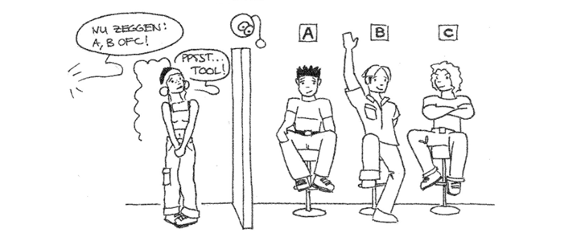

# 3. Keuze



Om een keuze te kunnen programmeren wordt in C++ het if-statement gebruikt.

`if (`_`voorwaarde`_`) {`\
&#x20;    ```     `_`code`_\
_``_`}`\
`else {`\
&#x20;   `code`\
`}`

Een voorwaarde is een expressie die waar of niet waar kan zijn. Bijvoorbeeld getal < 10. Als getal bijvoorbeeld de waarde 9 heeft dan is de expressie waar maar als getal bijvoorbeel de waarde 12 heeft dan is de expressie niet waar.

Als de voorwaarde waar is dan wordt de code in get eerste gedeelte uitgevoerd. Als er een else gedeelte is dan wordt dat alleen uitgevoerd als de voorwaarde niet waar is. Het else gedeelte kan je ook weglaten.

Een voorbeeld:

```clike
int getal;                
cout << "Voer een getal in: " << endl;      
cin >> getal;                  
if (getal < 10) {
    cout << "Het getal is kleiner dan 10" << endl;
}
else {
    cout << "Het getal is groter of gelijk aan 10" << endl;
}
```

De operatoren die je bij voorwaarde kan gebruiken zijn:

* \== (gelijk)
* != (ongelijk aan)
* \> (groter dan)
* < (kleiner dan)
* \>= (groter dan of gelijk aan)
* <= (kleiner dan of gelijk aan)

**Opdracht 8**\
****Schrijf een programma dat de afstand naar school inleest en als uitvoer geeft of je kan lopen of met de fiets moet.

Het is mogelijk om meerdere if-statements achter elkaar te schrijven.

`if (`_`voorwaarde1`_`) {`\
&#x20;  `//Als voorwaarde1 waar is`\
`} else if (`_`voorwaarde2`_`) {`\
&#x20;  `//Als voorwaarde1 niet waar is en voorwaarde2 wel waar is`\
`} else {`\
&#x20;  `//Als voorwaarde1 en voorwaarde2 niet waar zijn`\
`}`

**Opdracht 9**\
****Voeg de optie bus toe aan het programma van de vorige opgave.

**Opdracht 10**\
****Schrijf een programma dat 3 getallen inleest en als uitvoer de laagste van de 3 getallen geeft.

Het is mogelijk om meerdere if-statements in elkaar te schrijven. Dit noemen we nesting.&#x20;

&#x20;`if (getal1 < 10) {`\
&#x20;   `if (getal2 < 10) {`\
&#x20;     `cout << "getal1 en getal2 zijn beide kleiner dan 10";`\
&#x20;    `}`\
`}`

**Opdracht 11**\
****Schrijf een programma waarbij de gebruiker een jaartal kan invoeren en dat als uitvoer geeft of dit getal een schrikkeljaar is of niet.\
De regels om een schrikkeljaar te bepalen zijn:\
\- Een jaar is een schrikkeljaar als het een 4-voud is maar niet een 100-voud of\
\- Een jaar is een schrikkeljaar als het een 400-voud is.\
1900 is bijvoorbeeld een geen schrikkeljaar maar 2000 wel. Voor 1582 waren er geen schrikkeljaren.

### **Expressies**

.png>)

In een if-statement gebruik je een expressie van het type boolean. Een boolean kan 2 waardes hebben TRUE (=waar) of FALSE (=niet waar). Met de operatoren AND en OR kan je twee booleans combineren en dit levert een nieuwe boolean waarde op.

De And-operator levert True op als beide expressies True zijn. In alle andere gevallen is het resultaat false.

| **A** | **B** | **A And B** |
| ----- | ----- | ----------- |
| True  | True  | True        |
| True  | False | False       |
| False | True  | False       |
| False | False | False       |

De Or-operator levert True op als een beide expressies True is. Dus alleen als beide expressies False zijn, levert de or-operator False op.\


| **A** | **B** | **A Or B** |
| ----- | ----- | ---------- |
| True  | True  | True       |
| True  | False | True       |
| False | True  | True       |
| False | False | False      |

**Opdracht 12**\
****Leveren de volgende expressies TRUE of FALSE op:

* (5 > 8) or (10 ==10)
* (2==3) and (8 > 5)
