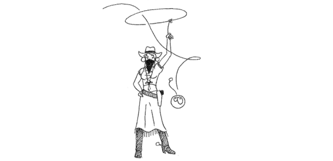

# 4. Herhalingen



Keuzes en herhalingen zijn waarschijnlijk de twee belangrijkste constructies in een programmeertaal. Keuzes hebben we al gezien in het vorige hoofdstuk. In dit hoofdstuk gaan we met herhalingen beginnen.

Herhalingen zijn belangrijk omdat je jezelf hiermee een hoop werk kunt besparen doordat je de computer meerdere malen hetzelfde of bijna hetzelfde kunt laten uitvoeren, zonder dat je elke stap moet programmeren. Er zijn meerdere manieren voor herhalingen.&#x20;

```clike
for (int i = 0; i < 5; i++) {
    cout << "Hello World\n";
}
```

De code i++ is een kortere versie van i = i + 1.

Bovenstaande optie schrijft het volgende naar het beeldscherm:\
Hello World\
Hello World\
Hello World\
Hello World\
Hello World

`for (`_`statement 1`_`;`` `_`statement 2`_`;`` `_`statement 3`_`) {`\
&#x20; `//`` `_`code`_\
`}`

Een for-lus bestaat uit 3 onderdelen:

* Statement 1: deze code wordt 1 keer uitgevoerd aan het begin van de herhaling.
* Statement 2: als deze expressie TRUE is dan zal de herhaling doorgaan. Als deze expressie FALSE is dan stopt de herhaling.
* Statement 3: deze code wordt na elke herhaling uitgevoerd.

Een tweede manier voor herhalingen is de while/do loop.

`while (conditie) {`\
```  `_`// code`_\
`}`

Zolang de conditie TRUE is wordt de code uitgoevoerd.

```clike
int i = 0;
while (i < 4) {
    cout << "Hello World\n";
    i++;
}
```

Ook bovenstaande code drukt 5 keer de tekst “Hello world”af.

**Opdracht 13**\
****Schrijf een programma dat een getal inleest en als uitvoer zoveel complimentjes geeft.

**Opdracht 14**\
****Schrijf een programma dat een getal inleest en de tafel van dit getal afdrukt.\
Bijvoorbeeld voor de tafel van 6 is de uitvoer:\
1 \* 6 = 6\
2 \* 6 = 12\
3 \* 6 = 18\
4 \* 6 = 24\
5 \* 6 = 30\
6 \* 6 = 36\
7 \* 6 = 42\
8 \* 6 = 48\
9 \* 6 = 54\
10 \* 6 = 60

**Opdracht 15**\
****Schrijf een programma waarbij de computer een willekeurig getal kiest en de gebruiker moet raden welk getal de computer gekozen heeft. Steeds zegt de computer of het getal hoger of lager is. Het programma stopt als de gebruiker het getal geraden heeft.\
De computer kan een willekeurig getal kiezen met de code:\
srand (time(NULL)); //deze regel hoeft maar 1 keer uitgevoerd te worden.\
int getal = rand() % 100; //deze regel kiest een willekeurig getal tussen 0 en 99\
Dit programma kan je nog uitbreiden door bij te houden hoeveel beurten de gebruiker er over gedaan heeft om het getal te raden
