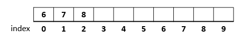
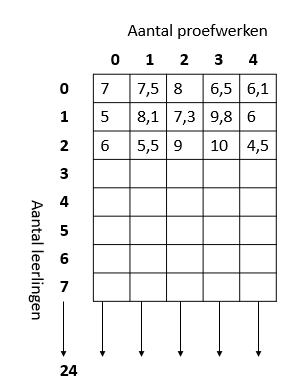

# 5. Arrays

Het kan voorkomen dat je in je programma veel variabelen van hetzelfde type gebruikt. Denk bijvoorbeeld aan een programma dat gegevens over de temperatuur van elke dag in het jaar wil opslaan. We kunnen hiervoor 365 variabelen aanmaken:

`float dag1, dag2, dag3, dag4, dag5, t/m dag365`

Als we dan het gemiddelde willen berekenen dan moet je schrijven:

`gemiddelde = (dag1 + dag2 + dag3 + dag4 + t/m dag365) / 365`

Dit is veel typwerk en dus niet zo handig. Dit kan slimmer. Hiervoor gebruiken we arrays:

`float dag[365]; //Dit is een array met de naam dag met 365 decimale getallen`

Een array kun je zien als een rij met hokjes waarin je een bepaalde waarde kan stoppen. Je moet bij het declareren van de array aangeven uit hoeveel hokjes de array bestaat en van welk de type de hokjes zijn.

`int rij[10];`

Deze array kun je als volgt voorstellen:



Elke hokje kan 1 integer bevatten.

De verschillende hokjes kunnen als volgt benaderd worden:&#x20;

`rij[1] = 7;`&#x20;

Het getal 1 geeft aan over welk hokje we het hebben (ook wel index genoemd), het getal 7 is hierbij de (nieuwe) inhoud van dat hokje. Let op het eerste hokje in de array heeft index 0.

Als we de code rij\[0] gebruiken dan krijgen we de waarde 6 terug in bovenstaand voorbeeld.

Een array kun je vullen met een for-loop.

```clike
int rij[10], getal;
for(int i=0;i<10;i++){
    cin >> getal;
    rij[i]= getal;
}
```

**Opdracht 16**\
****Schrijf een programma dat 10 proefwerkcijfers inleest en als uitvoer het gemiddelde van alle cijfers geeft.


**Opdracht 17**\
****Ook bij een string kun je met de \[ ] een letter uit de string selecteren.\
Schrijf een programma dat een woord inleest en als uitvoer het aantal verschillende letters in dat woord geeft.


**Opdracht 18**\
****Schrijf een programma dat om de invoer vraagt van het aantal keren dat met een dobbelsteen wordt gegooid. De computer gooit de dobbelsteen, gebruik hiervoor de rand() die je al eerder gebruikt hebt om een random getal tussen 1 en 6 te genereren. Geef als uitvoer hoe vaak elk getal gegooid is.

### **Meerdimensionele arrays**

Als je 5 proefwerkcijfers van de hele klas wil opslaan. Dan heb je bijvoorbeeld 25 arrays nodig met 5 cijfers. Hiervoor kun je ook een 2-dimensionale array gebruiken.

`float cijfer[25][5];`



`cijfer[1][4]` -> dit is het 5e proefwerkcijfer van leerling met index 1. Dit is een 6.

**Opdracht 19**\
****Schrijf een programma dat een leeg dambord afdrukt met de waarden X en 0. De X stelt een zwart veld voor een 0 een wit veld. Gebruik een 2-dimensionale array om het dambord in op te slaan.
