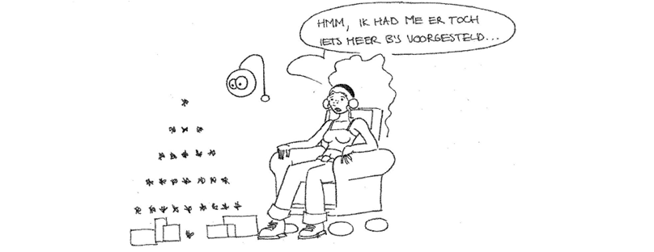
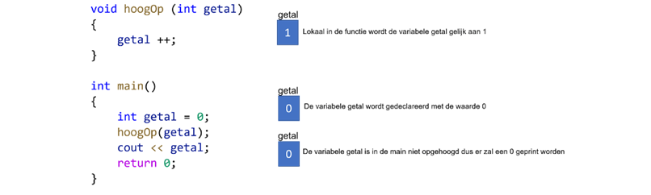
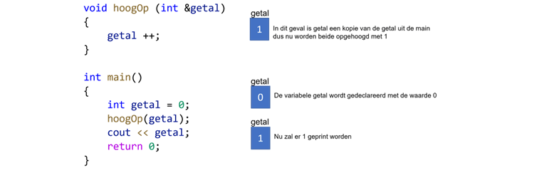

# 6. Functies

Het is in de meeste talen, waaronder C++, mogelijk kleine deelprogramma’s te ontwerpen. Deze kleine stukken code worden functies genoemd. Een goede programmeur gebruikt vaak meerdere functies, dit houdt de code namelijk overzichtelijk. Anders heb je kans dat de main een lange lap code wordt en dat je geen idee meer hebt wat er allemaal gebeurd. Bovendien is het zo dat als een functie meerdere keren wordt uitgevoerd en een fout bevat dat je deze nu in 1 keer kan oplossen.

Er bestaan twee soorten van functies: functies en procedures. Een functie voert handelingen uit en levert een resultaat op, bijvoorbeeld berekenOppervlakteCirkel (straal). Een procedure voert een aantal (vaak voorkomende) handelingen uit maar retourneert verder geen resultaat.

Voorbeeld van een functie:

```clike
int telOp (int getal1, int getal2) {
    int som;
    som = getal1 + getal2;
    return som;
}

int main() {
    int uitkomst;
    uitkomst = telOp(3,6);
    return 0;
}
```

In dit geval wordt de functie gedeclareerd van het type integer, deze functie levert dus ook een resultaat op van het type integer met de return.&#x20;

Een procedure levert niet een resultaat op en is dus van het type void:

`void voorbeeldProcedure( ) {`\
`// code`\
`}`&#x20;

**Opdracht 20**\
****Maak een programma dat een kerstboom tekent:

&#x20;`*`\
&#x20;   `***`\
&#x20;  `*****`\
&#x20; `*******`\
&#x20;`*********`\
`***********`\
&#x20;    `*`

Kies voor een nette oplossing met functies. Bijvoorbeeld: maak een Functie met als parameter het aantal sterretjes, die vervolgens één regel maakt uit de kerstboom met het juiste aantal spaties en dan het aantal aantal sterretjes. Vervolgens kan je bijvoorbeeld in een For-lus in de aanroepende Functie Kerstboom al die regels aan elkaar plakken.



### **Parameters**

De benodigde informatie voor een functie wordt doorgegeven middels de parameters; de variabelen in de functie-declaratie. Deze parameters moeten ook gedeclareerd worden met een type. Na het aangeroepen van de functie kunnen de parameters binnen die functie gebruikt worden als gewone variabelen.

Er zijn 2 soorten parameters:&#x20;

* Call by value: een kopie van de variabele wordt als parameter doorgegeven. Dit betekent dat als de variabele in de functie van waarde veranderd, de originele variabele nog steeds dezelfde waarde heeft.
* Call by reference: de variabele zelf wordt als parameter doorgegeven. Dit betekent dat als de variabele in de functie van waarde veranderd, de originele variabele ook van waarde is veranderd. Met een & teken voor de parameter geef je aan dat dit een call by reference variabele is

Voorbeeld van call by value:



Voorbeeld van call by reference:



**Opdracht 21**\
****Zoek uit hoe je een array moet doorgeven aan een functie.

### **Scope**

Je kunt variabelen op verschillende plekken declareren. De scope van de variabele wordt bepaald door de accolades { en }.

Een variabele boven in je programma wordt een globale variabele genoemd. De variabele kun je overal in je programma gebruiken.

In onderstaand voorbeeld kan je zien welke variabele je waar kan gebruiken.

```clike
int globaleVar; //Globale variabele kan je overal in je programma gebruiken
void test(int parameter){
    //hier kan je gebruiken: globaleVar, parameter
}
int main()          
{
    int lokaleVar
    //hier kan je gebruiken: globaleVar, lokaleVar
    for (int teller=0;teller<10; teller++){
        int var;
        //hier kan je gebruiken: globaleVar, lokaleVar, teller, var
    }
    //hier kan je gebruiken: globaleVar, lokaleVar
    return 0;            
}
```
