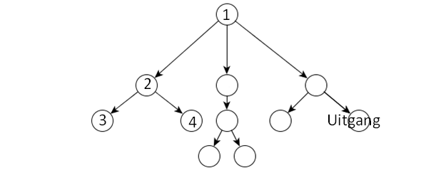

# 9. Backtracken

Backtracking is een methode voor het vinden van een oplossing. Het volgt een ‘route’ naar een oplossing totdat het duidelijk wordt dat langs deze weg geen oplossing gevonden kan worden. Op dit punt ga je dan weer terug langs het pad (backtrack) tot je een punt hebben bereikt waar vanuit we weer verder kunnen zoeken naar een oplossing. Als voorbeeld kun je denken aan het vinden van je weg in een onbekende stad. Op elk kruispunt kun je een keuze maken hoe je je route vervolgt. Loop  je vast, dan zet je een stapje terug.

Schematisch kan ‘vind je weg door een stad’ vanaf kruispunt één er zo uitzien:\
\- Maak een keuze: linksaf of rechtsaf.  Je kiest ervoor naar links te gaan, en loopt naar kruispunt twee.  Roep ‘vind je weg door een stad’ (recursief!) aan vanaf kruispunt twee.\
\- Maak een keuze: linksaf of rechtsaf. Je kiest ervoor naar links te gaan, en loopt naar kruispunt   drie .  Roep ‘vind je weg door een stad’ (recursief!) aan vanaf kruispunt drie.\
\- Bij kruispunt drie loopt je weg dood. Doe een stapje terug naar kruispunt 2.\
\- Ga nu rechtsaf, en loop naar kruispunt vier.\
\- Bij kruispunt vier loopt je weg dood. Doe een stapje terug naar kruispunt 2.\
\- Kruispunt 2 heb je beide opties linksaf en rechtsaf geprobeerd. Doe een stapje terug naar kruispunt 1.\
\- Ga nu rechtsaf, en loop naar …. Etc.



Backtracken werkt dus heel goed voor problemen waarbij je snel kunt inzien of een bepaalde oplossings-route ‘fout’ gaat. Een voorbeeld is het zogenoemde ‘n-koninginnen-probleem’, dat we hieronder beschrijven:

Hoe kun je N-koninginnen op een schaakbord met NxN vakken plaatsen, zodat ze elkaar niet kunnen slaan?

Bijvoorbeeld:


Als je dit probleem met backtracken wilt oplossen, dan is het nuttig je eerst te realiseren dat een vereiste is dat er in elke kolom (en elke rij) precies 1 koningin moet komen te staan. Dat betekent dat als je een koningin ergens op kolom 1 zet, de volgende koningin op kolom 2 moet komen te staan, en de volgende op kolom 3. Enzovoorts. De vraag is dan natuurlijk waar op elke kolom ze moeten komen te staan? Dat kun je met back-tracken proberen.

Stel je voor dat je de eerste koningin in kolom 1 op rij 1 zet. Dan kan de koningin op rij 2 niet meer in kolom 1, en ook niet in kolom 2 (want dan wordt die diagonaal geslagen). Maar kolom 3 kan nog wel. Dus zet je daar de koningin neer. En kan je door naar rij 3.

Als je op deze manier doorgaat, dan zul je merken dat je op een gegeven manier ‘vast’ komt te zitten. Je kunt de koninginnen op de laatste paar kolommen niet meer kwijt. Blijkbaar was een van je plaatsingen eerder toch niet zo handig. Nu moet je dus backtracken. Je laatste zet ongedaan maken en een andere rij proberen. Zo hier: je back-track algoritme! 😊

```clike
void losOp (int bord[N][N], int kolom) { 
    //als N koninginnen geplaatst zijn dan druk het bord af.
    if (kolom >= N) {
        drukAf(bord);
    }
  
    //doorloop alle rijen van de specifieke kolom
    for (int rij = 0; rij < N; rij++) { 
        // check of de koningin geplaatst kan worden op bord[rij][kolom] 
        if (geldig(bord, rij, kolom)) { 
            // plaats de koningin op bord[rij][kolom]
            bord[rij][kolom] = 1; 
  
            //recursie om de rest van de koninginnen te plaatsen
            losOp (bord, kolom + 1);
  
            //verwijder de koningin van bord[rij][kolom].
            bord[rij][kolom] = 0; // BACKTRACK 
        } 
    } 
} 
```

**Opdrachten koninginnen probleem**:

1. Teken op papier voor N = 4 uit hoe bovenstaande code de koninginnen op het bord plaatst en weer weghaalt.
2. Los het koninginnen probleem op voor N = 4. Gebruik bovenstaande code. Schrijf zelf de overige code en de functies drukAf en geldig.
3. Hoeveel verschillende oplossingen zijn er voor het koninginnen probleem waar N = 8? En N=12?

In de vorige opdracht plaats je de koninginnen op het schaakbord totdat:

1\.       Twee koningen elkaar kunnen slaan, dit is geen geldige oplossing, in dit geval backtrack je en ga je dus een stapje terug in de tree.

2\.       Er staan n koninginnen op het schaakbord die elkaar niet kunnen slaan, dit is een geldige oplossing, ook in dit geval backtrack je door weer een stapje terug te gaan in de tree.

In onderstaande tree zie je hoe systematisch naar de oplossingen voor het probleem met 4 koninginnen wordt gezocht:


**Opdrachten backtracken:**

1. Maak een programma dat alle permutaties van een string weergeeft. Bijvoorbeeld alle permutaties van ABC zijn: ABC, ACB, BAC, BCA, CBA, CAB
2. Schrijf een programma dat gegeven een set van integers en een integer K, alle subsets berekent die als som K hebben.\
   Voorbeeld\
   Input\
   Set van integers                : {10, 7, 5, 18, 12, 20, 15}\
   K                                         : 35\
   Output\
   Mogelijke subsets           : {10, 7, 18} want 10 + 7 + 18 = 35\
   Er zijn meer mogelijke subsets in dit voorbeeld. Je programma berekent alle mogelijke subsets.
3. Schrijf een programma dat in een doolhof de uitgang zoekt van links bovenin naar rechts onderin. In het doolhof liggen rotsblokken, hier kan je niet langs.\
   Voorbeeld\
   .png>)
4. Schrijf een programma dat Sudokus oplost.  Een sudoku speelveld bestaat uit een grid van 9x9 vakjes. Het veld is opgedeeld in 9 kleinere 3x3 deelvelden. In de vakjes moeten de getallen 1 t/m 9 worden ingevuld, zo dat\
   \- In elke rij elk getal precies één keer voorkomt\
   \- In elke kolom elk getal precies één keer voorkomt\
   \- In elk 3x3 deelveld elk getal precies één keer voorkomt.\
   Een aantal vakjes is vooraf al ingevuld. Maak hiervoor zelf keuzes. Als er bij de vooringevulde vakjes een oplossing is, laat dan je programma die oplossing afdrukken. Als er geen oplossing is, geeft je programma de uitvoer ‘geen oplossing’.&#x20;
